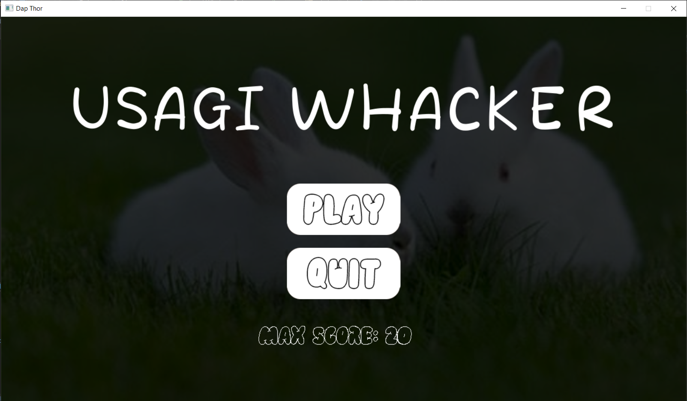
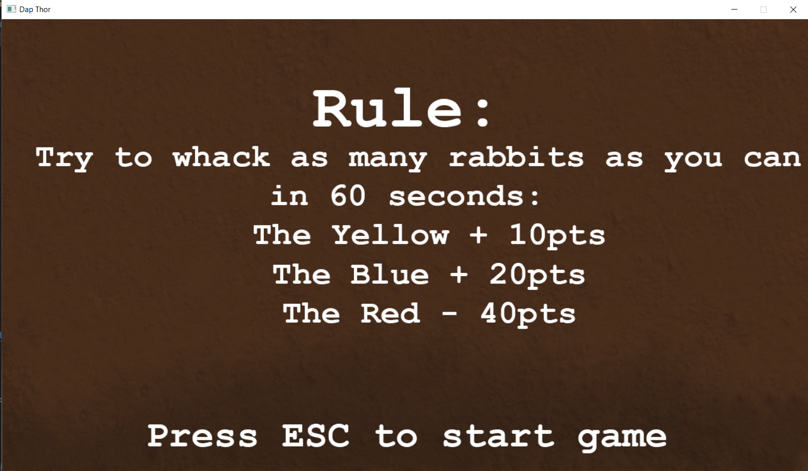
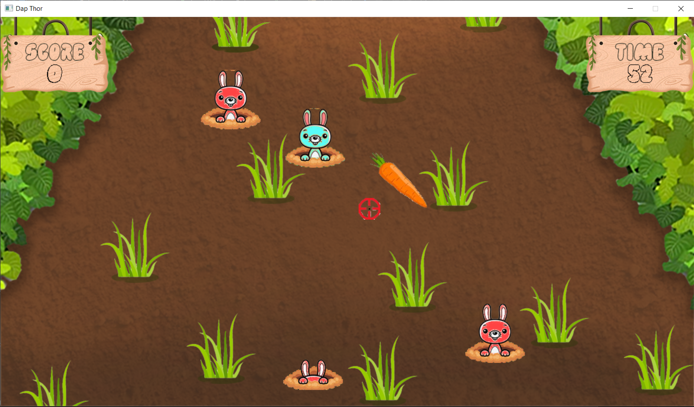
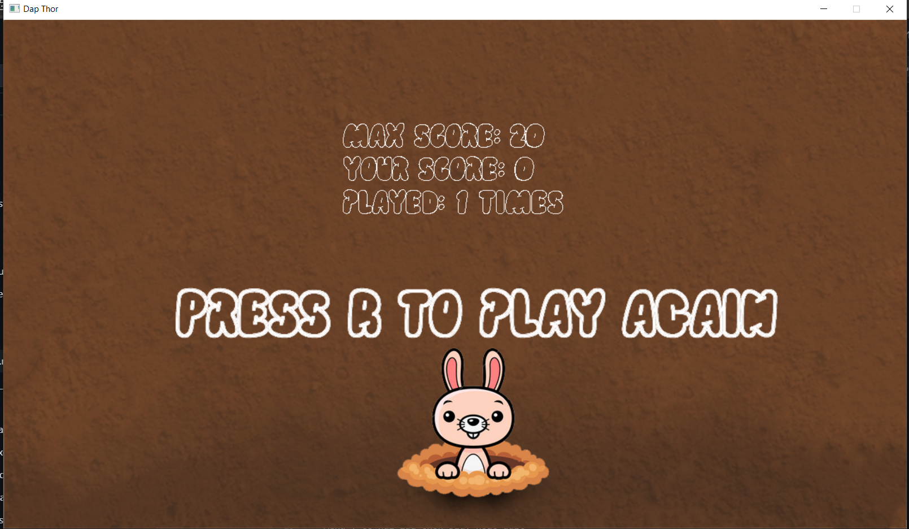

# Whack a usagi
- link preview game : 
# Cài đặt
- bản chạy được luôn : tải daptho.rar và giải nén từ [release](https://github.com/NTDat05/daptho/releases/tag/release)
- bản chạy trên IDE hoặc textEditor : clone repo hoặc Code -> download zip   Nếu dùng Visual Studio thì có thể vào file sln và cài đặt SDL2 rồi Ctrl + F5 để chạy

# Nguồn 
Các hình ảnh trong game tự thiết kế hoặc tìm ngẫu nhiên trên google ngoại trừ :
- spriesheets thỏ : [vectorstock.com](https://www.vectorstock.com/)
- âm thanh :[myinstant.com]( https://www.myinstants.com/)
- font : [1001fonts.com](https://www.1001fonts.com/)
# Giới Thiệu Game
 Lấy nguồn cảm hứng từ game đập chuột tuổi thơ
 Điểm khác biệt :
 - Thỏ sẽ spawn random trên màn hình thay vì cố định như bình thường
 - Tốc độ spawn và hoạt ảnh thỏ sẽ nhanh hơn theo thời gian
 - Đa dạng màu của thỏ sẽ khiến người chơi khó phân biệt để tránh thay vì bom ( bom dễ phân biệt so với thỏ)
# Bắt đầu game
- Menu : có hai lựa chọn play hoặc quit

- Rule : 

- Chơi : 

- kết thúc : có âm thanh phá kỉ lục và lựa chọn chơi lại

# Source code
- folder font: chứa font
- folder imgs: chứa hình ảnh, background, spritesheet,...
- folder sfx: hiệu ứng và âm thanh game
- main.cpp: chứa hàm main 
- - hàm showMenu(): hiển thị menu gồm tên game và hai nút play, quit
- - hàm showRule(): hiển thị luật chơi, nhấn esc để bắt đầu chơi 
- - hàm play (): chơi game, xử lý logic game, hiển thị điểm số, thời gian,...
- CommonFunc.cpp: khai báo thư viện và các hằng
- - định nghĩa hàm init để khởi tạo app
- - định nghĩa hàm loadMedia để tải dữ liệu
- - định nghĩa các hàm liên quan như kiểm tra va chạm
- - định nghĩa hàm close để xử lí hậu kì thoát chương trình
- Rabbit.cpp: chứa class Rabbit 
- - animate() : xử lí cho thỏ hiện lên lâu hơn chút 
